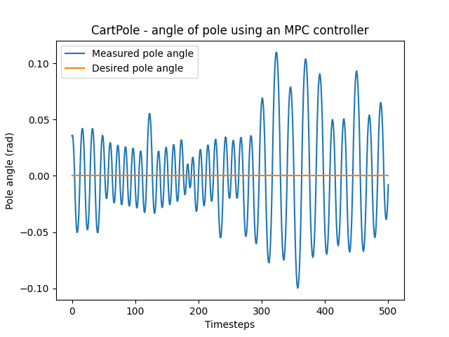

# CartPole with Model Predictive Control (MPC)

This project implements a Model Predictive Control (MPC) algorithm for the CartPole environment using OpenAI's Gymnasium. The objective is to keep the pole balanced on the cart for 500 timesteps.

## Overview

The CartPole environment consists of a cart that can move along a track with a pole attached to it. The goal is to balance the pole by applying forces to the cart. This implementation utilizes MPC to determine the optimal forces to apply to the cart based on its current state.

## Results

### Simulation GIF

### Performance Plot

### Simulation GIF With Control Input Weights Set To 0

### Performance Plot With Control Input Weights Set To 0

